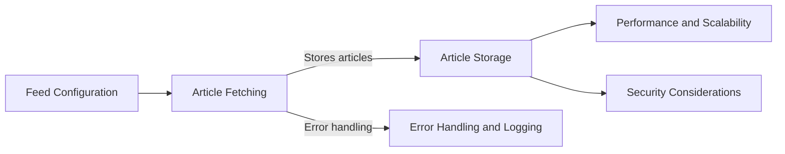

# RSS Feed Integration Subcomponent Design

The RSS Feed Integration subcomponent is a crucial part of the system, responsible for fetching and storing articles from various RSS feeds. This section delves into the detailed design of this subcomponent.

## Overview

The RSS Feed Integration subcomponent will:

1. Connect to multiple RSS feed sources.
2. Fetch new articles at scheduled intervals.
3. Store and manage fetched articles for further processing.

## Detailed Design

### 1. Feed Configuration

- **Feed List Management:** A configuration file or database table will list all the RSS feed URLs. This list can be updated to add or remove feeds.
- **Feed Attributes:** Store metadata for each feed, such as name, URL, fetch frequency, and last fetched timestamp.

### 2. Article Fetching

- **Scheduler:** Utilize cron jobs to schedule article fetching. Each feed can have a different fetching frequency based on its update frequency and importance.
- **Fetching Mechanism:** Python scripts using libraries like `feedparser` to parse RSS feeds. These scripts will handle different feed formats and extract necessary information such as title, author, publication date, and content.

### 3. Article Storage

- **Database Integration:** Use a database (e.g., SQLite, PostgreSQL) to store articles. The database schema will include fields for article ID, title, source feed, publication date, content, fetch date, and processing status.
- **Duplicate Handling:** Implement logic to check for and avoid storing duplicate articles. This can be based on a combination of title, publication date, and source feed.

### 4. Error Handling and Logging

- **Error Handling:** Implement robust error handling for issues like feed unavailability or format changes. The system should log errors and attempt re-fetching at the next scheduled interval.
- **Logging:** Maintain logs for each fetching operation, including timestamps, number of articles fetched, and any errors or warnings.

### 5. Performance and Scalability

- **Asynchronous Operations:** Consider using asynchronous programming (e.g., with `asyncio` in Python) to handle multiple feed fetches concurrently, improving efficiency.
- **Caching Mechanisms:** Implement caching to temporarily store feed data, reducing the load on feed servers and improving fetch performance.

### 6. Security Considerations

- **Data Sanitization:** Ensure that all fetched content is sanitized to prevent potential security risks like SQL injection when storing in the database.
- **Secure Storage:** Employ secure practices for storing sensitive data like database credentials or API keys used in fetching feeds.

## Diagram Representation

